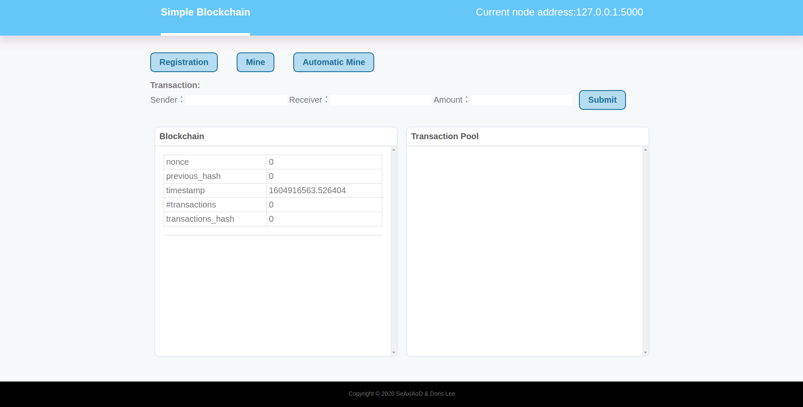

# simple_blockchain

## Introduction

Simple Blockchain Project

As the submitted project of CIE6125:Selected Topics in Blockchain System, The Chinese University of Hong Kong, Shenzhen.

## Data Description

##### Transactions

    {
        'sender': sender,
        'recipient': recipient,
        'amount': amount,
        'timestamp': timestamp
    }

##### Block

    {
        'nonce' = nonce,
        'previous_hash' = previous_hash,
        'timestamp' = timestamp,
        'transactions' = transactions,  # list
        'transactions_hash' = merkle_tree_hash
    }

##### Blockchain

    {
        'chain' = chain,  # list
        'transaction_pool' = transaction_pool,  # list
        'nodes' = nodes,  # set
        '_difficulty' = _difficulty  # private 
    }

## Enviroment

    python==3.7.6
    flask==1.1.1
    requests==2.22.0

## Usage

    python app.py  # start the first node (127.0.0.1:5000)
    python app.py -port 5001 # start the second node (127.0.0.1:5001)
    # Use browser to open 127.0.0.1:5000 and 127.0.0.1:5001.

1. We assume 127.0.0.1:5000 as the first node of blockchain.

2. In the codes, other nodes will register as new nodes from 127.0.0.1:5000.
At this time, we notice that the timestamp of the first block is differect in each nodes, since we haven't finish the synchronization of the blockchain.

3. Then we click the **Register** button in 127.0.0.1:5001. The timestamp of 127.0.0.1:5001 change to the same number of 127.0.0.1:5000. Note that, there is a interface as ip:port/nodes that could show current nodes in the blockchain.

4. We can arbitarily add transactions in any nodes by submitting the transaction form using **Submit** button, and the transaction pool will automatically synchronize the transaction data.

5. We seperate the mining process as step by step, so we can mannually click the **Mine** button to start a mining operation. The detailed information of mining will be displayed in terminal of backend. Note that the existing transaction pool will be cleared after once mining operation.

6. We also provide the automatic mining operation to simulate the simple decentralized blockchain system.

## User Interface

